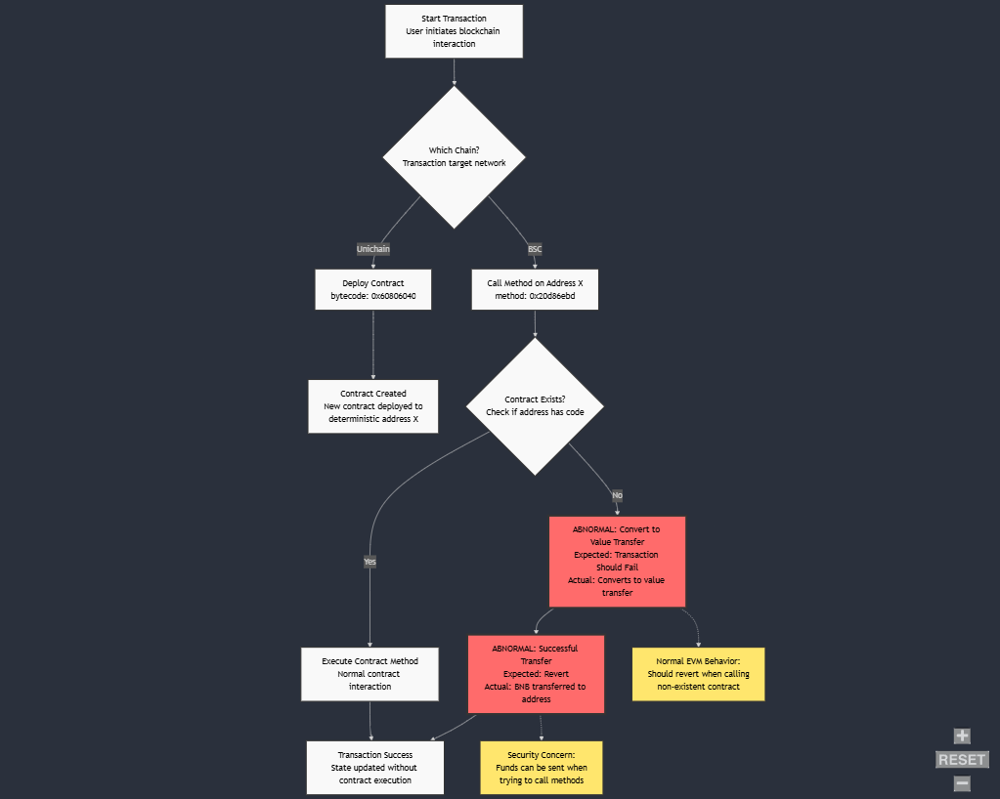

# Cross-Chain Contract Interaction Anomaly: BSC Method Call Behavior Analysis

## DISCLAIMER

This research paper documents findings from independent investigation conducted in February 2025. The behavior and vulnerabilities described herein have not been verified or validated by any third party, including but not limited to Binance, Unichain team, or security researchers. The findings are based solely on personal observations and testing. Readers should conduct their own verification and due diligence before acting on any information presented in this paper.

The author assumes no responsibility for any actions taken based on this research.

## Abstract

This research paper investigates an unusual behavior discovered in the Binance Smart Chain (BSC) regarding its handling of contract method calls to addresses without deployed contract code. The investigation reveals a significant deviation from standard Ethereum Virtual Machine (EVM) behavior, where method calls to non-existent contracts are converted to value transfers instead of reverting.

## 1. Introduction

### 1.1 Background

The Ethereum Virtual Machine (EVM) and its compatible chains have established standards for handling smart contract interactions. Typically, when attempting to call a method on an address without deployed contract code, the transaction should revert. However, our investigation reveals that BSC handles these situations differently.

### 1.2 Discovery Context

The behavior was initially discovered through an accidental cross-chain deployment scenario, where a contract intended for BSC was deployed on Unichain. Subsequent attempts to interact with the same address on BSC revealed the anomalous behavior.

## 2. Methodology

### 2.1 Test Environment

- Networks:
  - Binance Smart Chain (BSC) - Production Network
  - Unichain - Production Network
- Test Period: February 13-14, 2025
- Transaction Types:
  - Contract Deployments with bytecode 0x60806040
  - Method Calls with signature 0x20d86ebd
  - Value Transfers ranging from 0.00001 BNB to 23 BNB
- Test Wallets:
  - Primary: 0xf782585C32b9fCEC9D5665165d918479741F70e4
  - Secondary: 0xE7Ea52E476a75261920f008e053c2201F9ceE852

### 2.2 Test Cases

1. Initial Discovery Case:
   - Contract Deployment on Unichain
   - Method Call on BSC
   - Value Transfer Observation

2. Reproduction Case:
   - New Contract Deployment
   - Controlled Method Calls
   - Varied Value Amounts

## 3. Findings

### 3.1 Core Anomaly

When attempting to call a method on an address without deployed contract code on BSC:

- Expected Behavior: Transaction reversion
- Actual Behavior: Conversion to value transfer
- Success State: Transaction completes successfully

### 3.2 Technical Details

1. Transaction Characteristics:
   - Method Signature: 0x20d86ebd
   - Target Address: Identical across chains
   - Value Transfer: Successful execution

2. Behavioral Pattern:
   - Consistent across multiple test cases
   - Reproducible with different addresses
   - Independent of method signature

## 4. Security Implications

### 4.1 Immediate Concerns

1. Unintended Value Transfers:
   - Users expecting failed transactions
   - Actual execution of value transfers
   - Potential for fund misallocation

2. Cross-Chain Considerations:
   - Address collision risks
   - Unexpected behavior in cross-chain operations

### 4.2 Risk Mitigation

1. Development Recommendations:
   - Explicit address verification
   - Pre-transaction contract existence checks
   - Value transfer guards

2. User Recommendations:
   - Careful transaction verification
   - Test transactions with minimal values
   - Chain ID verification

## 5. Discussion

### 5.1 EVM Standards

The observed behavior represents a significant deviation from standard EVM implementation:

- Standard EVM: Reverts on non-existent contract calls
- BSC Implementation: Converts to value transfer
- Implications for cross-chain development

### 5.2 Network Implications

This behavior raises questions about:

- BSC's EVM compatibility
- Cross-chain interaction safety
- Smart contract deployment strategies

## 6. Conclusion

The discovered behavior in BSC's handling of contract method calls represents a significant deviation from expected EVM behavior. This has important implications for developers working with cross-chain applications and requires careful consideration in deployment and interaction strategies.

## 7. Recommendations

### 7.1 For Developers

1. Implement explicit checks for contract existence
2. Add value transfer guards in cross-chain applications
3. Test thoroughly with minimal values

### 7.2 For Users

1. Verify target addresses carefully
2. Confirm chain IDs before transactions
3. Use test transactions with minimal values

## References

### Discovery Case

[Unichain Deployment](https://uniscan.xyz/tx/0x0774441ceff0a365e080b1042d1f55eae42f2fd67bc5df42de49ddbc248b4686) | [BSC Method Call](https://bscscan.com/tx/0x5cb9db66530bad903ee50b15cf79a2dd4862fe99e23e384599eec2f06b2bf60b)

### Reproduction Case

[Unichain Deployment](https://uniscan.xyz/tx/0x197861df46c05f7c8df8aa65a04d99211dad8cea1d17fd1912d6f09010706168) | [BSC Method Call](https://bsctrace.com/tx/0x358c8751857d7b0037da7b09f9a11f453ba94bc784d3292de350dab4ba62d10e)

### Abnormality Flowchart



## Appendix A: Test Transaction Details

### Case 1: Initial Discovery

1. Unichain Contract Deployment:
   - Transaction Hash: 0x0774441ceff0a365e080b1042d1f55eae42f2fd67bc5df42de49ddbc248b4686
   - Contract Address: 0x85bcf62490d2d6dea051b2887eff868a2d17fe9b
   - From: 0xf782585C32b9fCEC9D5665165d918479741F70e4
   - Method: 0x60806040
   - Value: 0 ETH
   - Block: 8715100

2. BSC Method Call:
   - Transaction Hash: 0x5cb9db66530bad903ee50b15cf79a2dd4862fe99e23e384599eec2f06b2bf60b
   - To: 0x85bcF62490d2D6deA051B2887EfF868a2d17FE9B
   - From: 0xE7Ea52E476a75261920f008e053c2201F9ceE852
   - Method: 0x20d86ebd
   - Value: 23 BNB (~$15,415.94)
   - Block: 46627352

### Case 2: Reproduction Test

1. Unichain Contract Deployment:
   - Transaction Hash: 0x197861df46c05f7c8df8aa65a04d99211dad8cea1d17fd1912d6f09010706168
   - Contract Address: 0x3985581a5634f401b1afafe45e4f7d7fcc8123ca
   - From: 0xf782585C32b9fCEC9D5665165d918479741F70e4
   - Method: 0x60806040
   - Value: 0 ETH
   - Block: 8775574

2. BSC Method Call:
   - Transaction Hash: 0x358c8751857d7b0037da7b09f9a11f453ba94bc784d3292de350dab4ba62d10e
   - To: 0x3985581a5634f401b1afafe45e4f7d7fcc8123ca
   - From: 0xf782585c32b9fcec9d5665165d918479741f70e4
   - Method: 0x20d86ebd
   - Value: 0.00001 BNB
   - Block: 46647563
   - Gas Used: 22,776 (98.55%)
   - Gas Price: 1 Gwei

## Appendix B: Technical Data Analysis

### Transaction Input Data Sample

```hex
0x20d86ebd000000000000000000000000000000000000
0000000000000000000000000002000000000000000
0000000000005ec5f3ce5783452a312a9a7c1b7ce9cde55
fe0b000000000000000000000000f782585c32b9fcec9d
5665165d918479741f70e4000000000000000000000000
0000000000000000000000000000000000000060000
0000000000000000000000000000000000000000000
000000000000000001000000000000000000000000f7
82585c32b9fcec9d5665165d918479741f70e4000000000
0000000000000000000000000000000000000000000
09184e72a000
```

### Network Specifications

1. BSC (BNB Chain):
   - Chain ID: 56
   - Consensus: Proof of Staked Authority (PoSA)
   - Block Time: ~3 seconds

2. Unichain:
   - Chain ID: 130
   - Type: L2 Optimistic Rollup
   - Block Time: 1 second
